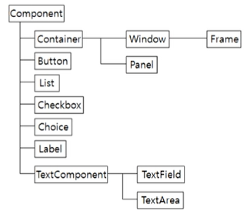
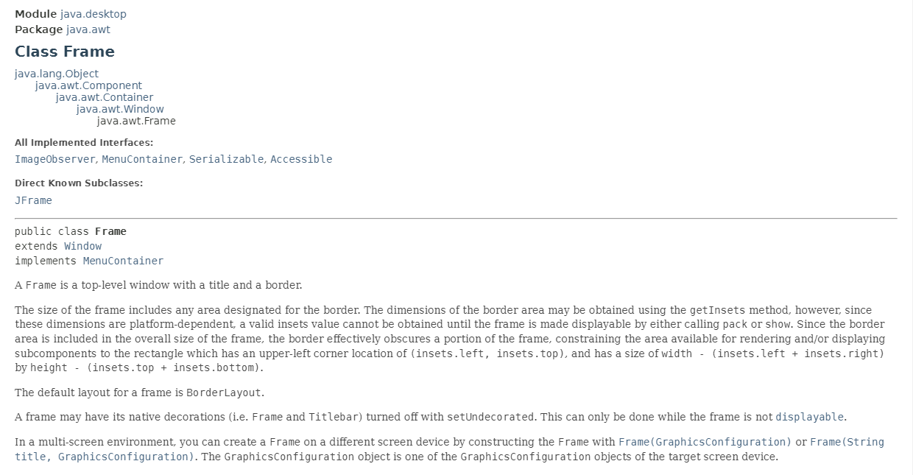

# Java Application
> Console Application
> - Dos와 같은 텍스트 기반 어플리케이션
> 
> Windows Application
> - GUI 기반 어플리케이션
> - GUI 프로그래밍 도구
>   - AWT (Abstract <u>Windows</u> Toolkit)
>   - Swing


## AWT Class 계층도



## Class 확인

- `Shift + F2` 입력 시 Api 문서 확인 가능.
- `ctrl + shift + o` 입력시 class import.
- `import java.awt.*;` `awt`에 속해 있는 모든 클래스 사용 가능.




### Example

```java
package Component;

import java.awt.*;
// import 오류 시 `module_info.java` 파일 확인

public class FrameEx2 extends Frame{
	
	Button btn;
	TextField tf1, tf2, tf3, tf4;
	TextArea ta1, ta2;
	Checkbox ch1, ch2, ch3, ch4;
	Label lab1, lab2, lab3;
	List lst;
	
	CheckboxGroup cg;
	
	
	public FrameEx2 ( ) {
		super("component test");
		
		setSize(400,800);
        
        Toolkit tk = Toolkit.getDefaultToolkit();
        Dimension screenSize = tk.getScreenSize();
        setLocation(screenSize.width/2-200, screenSize.height/2 - 400 );
        setLayout(new FlowLayout());
        // this.setBackground(Color.CYAN);
        // this.setBackground(new Color(100,0,0);
        
        btn = new Button("check");
//        btn.setSize(100, 50);
//        btn.setLocation(50, 50);
        btn.setBackground(Color.yellow);
        btn.setForeground(Color.red);
        add(btn);
        
        tf1 = new TextField();
        add(tf1);
        
        lab1 = new Label("Name");
        lab1.setBackground(Color.CYAN);
        add(lab1);
        
        tf2 = new TextField(20);
        add(tf2);
        
        tf3 = new TextField("hello this is deep");
        add(tf3);
        
        tf4 = new TextField("hello this is deep", 30);
        add(tf4);
        
        //ta1 = new TextArea(10,10);
        //add(ta1);
        
        // TextArea(String text, int rows, int Columns, int ScrollBars)
        ta2 = new TextArea("내용 입력", 10, 30, TextArea.SCROLLBARS_NONE);
        add(ta2);
        
        ch1 = new Checkbox("exercise");
        add(ch1);
        ch2 = new Checkbox("reading",true);
        add(ch2);
        
        cg = new CheckboxGroup();
        ch3 = new Checkbox("male", true, cg);
        add(ch3);
        ch4 = new Checkbox("female", false, cg);
        add(ch4);
        
        //lab1 = new Label("Name");
        //lab1.setBackground(Color.CYAN);
        //add(lab1);
        
        lab2 = new Label("Phone Number", Label.RIGHT);
        lab2.setBackground(Color.GRAY);
        add(lab2);
        
        lab3 = new Label("Age", Label.CENTER);
        lab3.setBackground(Color.BLUE);
        add(lab3);
        
        lst = new List(3, true);
        // true 복수개 선택, false 단일
        add(lst);
        lst.add("Lotte");
        lst.add("Kia");
        lst.add("SGG");
        lst.add("Nexon",2);
        
        lst.remove(2);
        
	}
	
	public static void main(String[] args) {
		FrameEx2 f = new FrameEx2();
		f.setVisible(true);
		
	}
	
}
```


#### 1) Frame 위치 조정

- `getScreenSize()`를 이용해 화면 크기를 측정, 원하는 위치에 `f`를 생성

  ```java
  public class FrameEx {
  	public static void main(String[] args) {
  		Frame f = new Frame("test");
          f.setSize(300,300);
          Toolkit tk = Toolkit.getDefaultToolkit();
          Dimension screenSize = tk.getScreenSize();   
          f.setLocation(screenSize.width/2-150, screenSize.height/2 - 150 );
          f.setVisible(true);
  	}
  }
  ```


#### 2) Button & Text

- Button 클래스를 사용해 버튼을 추가.
  - `btn.setSize()`, `btn.setLocation()`을 이용해 버튼 크기, 위치 조정
  -  `this.setLayout(new FlowLayout())`을 이용해 `Layout` 설정 시 위치가 자동으로 지정된다.
  - `setBackground(Color.Red)`, `setForeground`를 이용해 색을 지정가능하다. 이때 `Foreground`는 버튼의 글자색을 변경.
- TextField 클래스 이용 text 영역 추가.
  -  `tf4 = new TextField("hello this is deep", 30);` 크기가 30이며 "hello this is deep"이라는 문자열이 입력되어 있는 text 영역이 추가된다.

- `TextArea(String text, int rows, int Columns, int ScrollBars)` 행태의 text 영역 추가 가능

  - `string text`는 입력될 문자열 
  - int rows 가로 영역
  - int columns 세로 영역
  - int ScrollBars 스크롤바 설정
    - `SCROLLBARS_BOTH`, `SCROLLBARS_HORIZONTAL_ONLY`, `SCROLLBARS_NONE`, `SCROLLBARS_VERTICAL_ONLY`

  ```java
  ta2 = new TextArea("내용 입력", 10, 30, TextArea.SCROLLBARS_NONE);
  add(ta2);
  ```

  

#### 3) Check Box

- Checkbox 클래스를 이용해 체크가 가능한 버튼 생성.
  - `new Checkbox("text",true)`를 이용해 text가 입력되어 있는 `Checkbox` 생성
    - `true`입력 시 체크가 되어있는 체크박스 생성.
  - `CheckboxGroup()`을 생성하고 `Checkbox` 생성 시 radio box와 같은 기능을 하는 박스 생성

```java
 ch1 = new Checkbox("exercise");
        add(ch1);
        ch2 = new Checkbox("reading",true);
        add(ch2);
        
        cg = new CheckboxGroup();
        ch3 = new Checkbox("male", true, cg);
        add(ch3);
        ch4 = new Checkbox("female", false, cg);
        add(ch4);
```


#### 4) Label & List

- Label 클래스 이용 Label 생성
  - `setBackground`를 이용 색 지정 가능.
  - `Label("text", Label.RIGHT)` Label 내의 text 위치를 지정
    - `RIGHT`, `LEFT`, `CENTER` 등 
  - Label의 코드 위치에 따라서 프로그램 생성시 Label 위치를 지정할 수 있다.
- List 클래스 이용 List 생성
  - `List(N,false)`에서 true일 경우 복수개 선택 가능, false일 경우 단일 선택
  - `list.add()`를 이용해 원하는 인덱스 위치에 데이터를 추가 가능하고, `list.remove()`로 제거 가능

```java
lab2 = new Label("Phone Number", Label.RIGHT);
        lab2.setBackground(Color.GRAY);
        add(lab2);
        
        lab3 = new Label("Age", Label.CENTER);
        lab3.setBackground(Color.BLUE);
        add(lab3);
        
        lst = new List(3, true);
        // true 복수개 선택, false 단일
        add(lst);
        lst.add("Lotte");
        lst.add("Kia");
        lst.add("SGG");
        lst.add("Nexon",2);
        
        lst.remove(2)
```

