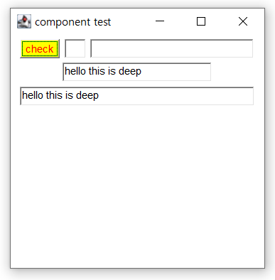

# Java Application
> Console Application
> - Dos와 같은 텍스트 기반 어플리케이션
> 
> Windows Application
> - GUI 기반 어플리케이션
> - GUI 프로그래밍 도구
>   - AWT (Abstract <u>Windows</u> Toolkit)
>   - Swing


## AWT Class 계층도


### 예제_Frame 생성

```java
package Component;

import java.awt.Frame;

public class FrameEx {
	
	public static void main(String[] args) {
		Frame f = new Frame("test");
        f.setSize(300,300);
        f.setVisible(true);
	}
}
```

> `java.awt.Frame` 오류 발생 시 `module_info.java` 파일 확인


## Class 확인

- `Shift + F2` 입력 시 Api 문서 확인 가능


### 예제_Frame 위치 조정

```java
package Component;

import java.awt.Dimension;
import java.awt.Frame;
import java.awt.Toolkit;

public class FrameEx {
	
	public static void main(String[] args) {
		Frame f = new Frame("test");
        f.setSize(300,300);
        
        Toolkit tk = Toolkit.getDefaultToolkit();
        Dimension screenSize = tk.getScreenSize();
        
        //System.out.println(screenSize);
        
        f.setLocation(screenSize.width/2-150, screenSize.height/2 - 150 );
        f.setVisible(true);
	}
}
```

> - `getScreenSize()`를 이용해 화면 크기를 측정, 원하는 위치에 `f`를 생성
>
> ※ `ctrl + shift + o` 자동으로 `class`를 `import` 한다.


### 예제_Button_Text_field

```java
package Component;

import java.awt.Button;
import java.awt.Color;
import java.awt.Dimension;
import java.awt.FlowLayout;
import java.awt.Frame;
import java.awt.TextField;
import java.awt.Toolkit;

public class FrameEx2 extends Frame{
	
	Button btn;
	TextField tf1, tf2, tf3, tf4;
	
	public FrameEx2 ( ) {
		super("component test");
		
		setSize(300,300);
        
        Toolkit tk = Toolkit.getDefaultToolkit();
        Dimension screenSize = tk.getScreenSize();
        setLocation(screenSize.width/2-150, screenSize.height/2 - 150 );
        setLayout(new FlowLayout());
        // this.setBackground(Color.CYAN);
        // this.setBackground(new Color(100,0,0);
        
        btn = new Button("check");
        // btn.setSize(100, 50);
        // btn.setLocation(50, 50);
        // FlowLayout()에 의해서 영향 없어짐
        btn.setBackground(Color.yellow);
        btn.setForeground(Color.red);
        add(btn);
        
        tf1 = new TextField();
        add(tf1);
        
        tf2 = new TextField(20);
        add(tf2);
        
        tf3 = new TextField("hello this is deep");
        add(tf3);
        
        tf4 = new TextField("hello this is deep", 30);
        add(tf4);
	}
	
	public static void main(String[] args) {
		FrameEx2 f = new FrameEx2();
		f.setVisible(true);
		
	}
	
}
```




