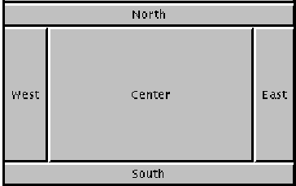
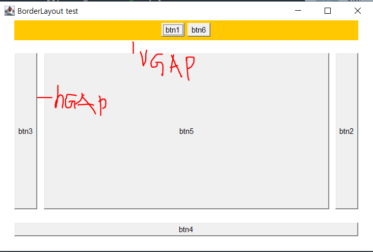
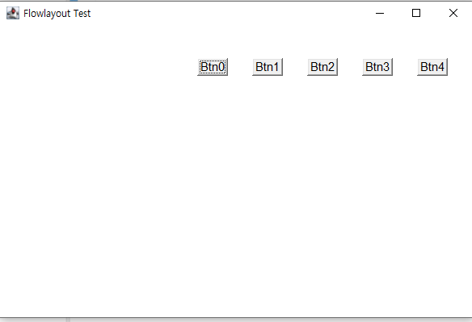
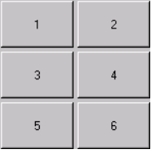
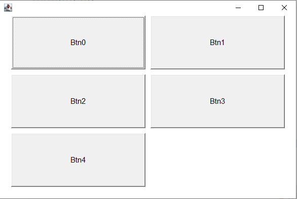
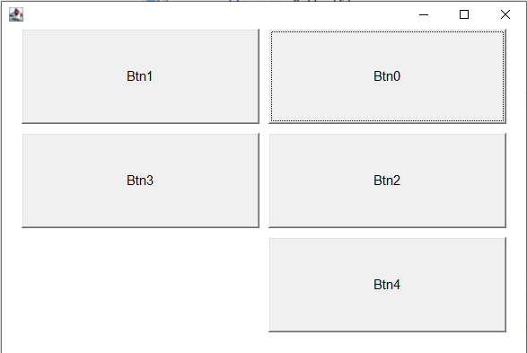

# Layout Manager

> 컨테이너에 포함된 컴포넌트의 배치를 자동관리
>
> Layout manager 사용하면 컨테이너의 크기가 변경되거나 새로운 컴포넌트가 추가될 때, 컴포넌트를 재배치하는 코드를 작성할 필요가 없다.
>
> AWT에서는 5개의 Layout Manager 제공
>
> - BorderLayout, FlowLayout, GridLayout, CardLayout, GridbagLayout


## BorderLayout

- 위, 아래, 왼쪽, 오른쪽, 중간 5개의 영역을 갖는다



- `BorderLayout(int hgap, int vgap)`을 통해서 위 아래, 양 옆 영역간의 간격을 조절한다.
- `Insets(int north, int west, int south, int east)`을 통해 `Frame` 창 기준으로 간격을 정한다.

```java
package Layout;

import java.awt.BorderLayout;
import java.awt.Button;
import java.awt.Color;
import java.awt.Frame;
import java.awt.Insets;
import java.awt.Panel;

public class BorderL extends Frame {
	Button btn1, btn2, btn3, btn4, btn5, btn6;
	
	Panel p;
	public BorderL() {
		super("BorderLayout test");
		BorderLayout bl = new BorderLayout(10, 20);
		setLayout(bl);
		setSize(600,400);
		p = new Panel();
		
		btn1 = new Button("btn1");
		btn2 = new Button("btn2");
		btn3 = new Button("btn3");
		btn4 = new Button("btn4");
		btn5 = new Button("btn5");
		btn6 = new Button("btn6");
		
		p.add(btn1);
		p.add(btn6);
		p.setBackground(Color.orange);
		add(p, "North");
		add(btn2, BorderLayout.EAST);
		add(btn3, "West");
		add(btn4, "South");
		add(btn5, "Center");
	}
	
	public Insets getInsets() {
		Insets is = new Insets(30, 30, 30, 30);
		return is;
	}
	
	public static void main(String[] args) {
		BorderL fb = new BorderL();
		fb.setVisible(true);
	}
}

```




## FlowLayout

- 설정 방향 순서대로 배치
- `FlowLayout.RIGHT`, `FlowLayout.LEFT`, `FlowLayout.CENTER` 등으로 설정가능하다.
- 외곽 테두리의 간격은 BorderLayout에서 나온것과 마찬가지로 `Insets`을 이용해 설정가능하다.

```java
package Layout;

import java.awt.*;

public class FlowLayoutEx extends Frame{
	
	Button btn1, btn2, btn3, btn4, btn5;
	
	Button btn[];
	
	
	public FlowLayoutEx() {
		super("Flowlayout Test");
		setSize(600,400);
		
		FlowLayout f = new FlowLayout(FlowLayout.RIGHT, 30, 40);
//		FlowLayout f = new FlowLayout();
		setLayout(f);
		
		btn = new Button[5];
		for(int i = 0; i < btn.length; i++) {
			btn[i] = new Button("Btn" + i);
			add(btn[i]);
		}
		
	}	
	
	public static void main(String[] args) {
		FlowLayoutEx feEx = new FlowLayoutEx();
		feEx.setVisible(true);
	}

}
```



## GridLayout

- 격자 무늬 순서대로 배치하는 Layout



- 기본적으로 왼쪽에서 오른쪽으로 넘어가는 순서를 갖는다.
  - `setComponentOrientation`을 이용해 순서를 오른쪽에서 왼쪽으로 변경할 수 있다.

```java
package Layout;

import java.awt.*;

import javax.swing.plaf.basic.BasicSplitPaneUI.KeyboardDownRightHandler;

public class GridLayoutEx extends Frame {
	
	Button btn1, btn2, btn3, btn4, btn5;
	Button btn[];
	
	public GridLayoutEx() {
		GridLayout gl = new GridLayout(3, 2, 10, 10);
		setLayout(gl);
		setSize(600,400);
		
		btn = new Button[5];
		for(int i = 0; i < btn.length; i++) {
			btn[i] = new Button("Btn" + i);
			add(btn[i]);
		}
		
		setComponentOrientation(ComponentOrientation.RIGHT_TO_LEFT);
	}
		public Insets getInsets() {
			Insets is = new Insets(30,  30, 30, 30);
			return is;
		}
	
	public static void main(String[] args) {
		GridLayoutEx g = new GridLayoutEx();
		g.setVisible(true);
	}
}
```

                                                            


## CardLayout

- 여러 개의 컨테이너를 CardLayout에 추가해 순서대로, 임의의 컨테이너를 선택해 보여줄 수 있는 Layout.
- `setbound(x,y,width,height)`을 이용해 사이즈를 조절할 수 있다.
  - x - x축 위치, y - y축 위치, width - 넓이 , height - 높이
- `next`, `previous`등 여러 함수들을 이용해 순서를 결정할 수 있다.
  - `card.next(this)` : 다음 card를 보여준다
  - `card.previoud(this)` : 이전 card를 보여준다.
  - `card.show(this, "name")` :  "name" card를 바로 보여준다.

```java
package Layout;

import java.awt.*;

public class CardL extends Frame {
	
	CardLayout card;
	Panel p1, p2, p3, p4;
	
	public CardL() {
		super("CardLayout test");
		card = new CardLayout();
		
		setLayout(card);
		
		p1 = new Panel();
		p1.setBackground(Color.BLUE);
		p1.add(new Label("CARD 1"));
		
		p2 = new Panel();
		p2.setBackground(Color.CYAN);
		p2.add(new Label("CARD 2"));
		
		p3 = new Panel();
		p3.setBackground(Color.GRAY);
		p3.add(new Label("CARD 3"));
		
		p4 = new Panel();
		p4.setBackground(Color.PINK);
		p4.add(new Label("CARD 4"));
		
		add(p1,"1");
		add(p2,"2");
		add(p3,"3");
		add(p4,"4");
	}
	
	public void next() {
		for(int i = 0; i < 3;i++) {
			try {
				Thread.sleep(2000);
			} catch (InterruptedException e) {
				e.printStackTrace();
			}
			card.next(this);
			//card.show(this, "3");
		}
	}
	
	public static void main(String[] args) {
		CardL c = new CardL();
		c.setBounds(300,300,200,200);
		c.setVisible(true);
		c.next();
	}

}
```

