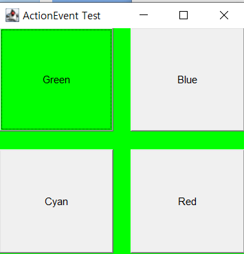
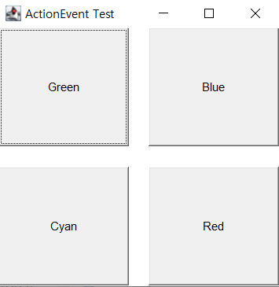
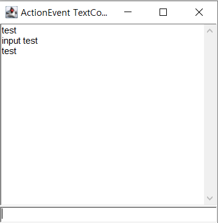
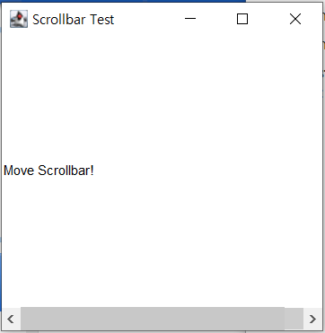
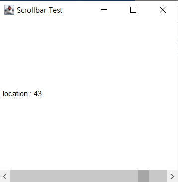

# Event Handler

> Event : 사용자 또는 프로그램에 의해 발생할 수 있는 하나의 사건

※ 이벤트 처리를 위한 기본 용어

- Event Source : 컴포넌트, 컨테이너 ex) Button, Pannel
- Event : 이벤트 소스별 각각의 이벤트가 존재
- Event Handler : 이벤트를 처리해 주는 클래스 의미
- Event Listener : 이벤트 소스와 이벤트 핸들러 연결


## Mouse Click Event

- 마우스 클릭 시 다음 Card Layer로 넘어가는 예제
- `pannel.addMouseListener`을 이용해서 각 pannel 마다 Mouse 이벤트를 감지
- `mouseClicked(MouseEvent e)` 함수를 이용해 이벤트 감지 시 동작 설정

```java
package Event;

import java.awt.CardLayout;
import java.awt.Color;
import java.awt.Frame;
import java.awt.Panel;
import java.awt.event.MouseEvent;
import java.awt.event.MouseListener;
import java.security.PublicKey;

public class EventEx1 extends Frame implements MouseListener{
	Panel p1 = new Panel();
	Panel p2 = new Panel();
	Panel p3 = new Panel();
	Panel p4 = new Panel();
	
	CardLayout card = new CardLayout();
	
	public EventEx1() {
		super("Event Test");
		setLayout(card);
		setBounds(200,200,300,300);
		p1.setBackground(Color.cyan);
		p2.setBackground(Color.YELLOW);
		p3.setBackground(Color.BLUE);
		p4.setBackground(Color.RED);
		
		add("1",p1);
		add("2",p2);
		add("3",p3);
		add("4",p4);
		
		p1.addMouseListener(this);
		p2.addMouseListener(this);
		p3.addMouseListener(this);
		p4.addMouseListener(this);
	}
	
	public void mouseClicked(MouseEvent e) {
		card.next(this);
	} // 마우스 클릭 시 마다 카드가 넘어간다.
	
	public void mouseEntered(MouseEvent e) {}
	public void mouseExited(MouseEvent e) {}
	public void mousePressed(MouseEvent e) {}
	public void mouseReleasd(MouseEvent e) {}
	
	public static void main(String[] args) {
		EventEx1 ev = new EventEx1();
		ev.setVisible(true);
	}
}
```


## Action Event

- Button 클릭 시 해당 버튼의 색으로 칠해지는 예제
  - 다시 한번 클릭 시 초기 색으로 복구
- `Button.addActionListener`를 이용해 각 버튼마다 이벤트 감지
- `actionPerformed(ActionEvent ae)` 함수를 이용 이벤트 마다 동작 설정
  - `getActionCommand`로 이벤트가 발생한 버튼의 색을 불러와 버튼과 여백의 색 변경
  - `getBackground`를 이용해 이벤트가 발생한 버튼의 색이 이미 변경된 상태면 원래의 상태로 변경

```java
package Event;

import java.awt.*;
import java.awt.event.ActionEvent;
import java.awt.event.ActionListener;

public class ActionBtn extends Frame implements ActionListener {
	Button btn[] = new Button[4];
	String str[] = {"Green", "Blue", "Cyan", "Red"};
	Color cl = new Color(240,240,240);
	public ActionBtn() {
		super("ActionEvent Test");
		setLayout(new GridLayout(2,2,20,20));
		setBounds(200, 200, 300, 300);
		for(int i = 0; i < btn.length;i++) {
			btn[i] = new Button(str[i]);
			add(btn[i]);
			btn[i].addActionListener(this);
		}
	}

	public static void main(String[] args) {
		ActionBtn ab = new ActionBtn();
		ab.setVisible(true);
	}
	
	public void actionPerformed(ActionEvent ae) {
		String str = ae.getActionCommand();
		if(str.equals("Green")) {
			if (btn[0].getBackground().equals(Color.green)) {
				btn[0].setBackground(cl);
				setBackground(Color.white);
			} else {
				btn[0].setBackground(Color.green);
				setBackground(Color.green);
			}
		} else if (str.equals("Blue")) {
			if (btn[1].getBackground().equals(Color.blue)) {
				btn[1].setBackground(cl);
				setBackground(Color.white);
			} else {
				btn[1].setBackground(Color.blue);
				setBackground(Color.blue);
			}
		} else if (str.equals("Cyan")) {
			if (btn[2].getBackground().equals(Color.cyan)) {
				btn[2].setBackground(cl);
				setBackground(Color.white);
			} else {
				btn[2].setBackground(Color.cyan);
				setBackground(Color.cyan);
			}
		} else if (str.equals("Red")) {
			if (btn[3].getBackground().equals(Color.red)) {
				btn[3].setBackground(cl);
				setBackground(Color.white);
			} else {
				btn[3].setBackground(Color.red);
				setBackground(Color.red);
			}
		}
	}
}
```

     


## Action Text

- Text 영역 입력을 통해 Event를 발생시키는 예제
  - `TextField`에 입력 후 Enter를 입력하면 `TextArea`에 입력된 문자가 저장된다.
- `tf` 영역에 `ActionListener`추가
  - `actionPerformed`에서 `getText()`을 통해 입력된 문자를 `str` 변수에 저장
  - `ta.append()`를 통해 저장된 `str`문자를 `ta` 영역에 추가한다.
    - `println` 사용시 다음 문자 입력시 기존 문자를 지우고 새로 저장한다.
    - `append`는 저장된 문자 뒤에 추가로 연결
- `requestFocus` 함수는 마우스 커서를 해당 영역에 가도록 해준다.
  - 즉 프로그램 실행 및 이벤트 발생 후 `tf`영역으로 입력 커서가 자동 설정
    - `setEditable` : false로 설정 시 클릭은 되지만 입력 불가
    - `setFocusable` : false로 설정 시 클릭 불가

※ `System.out.println(str)` : console 창에 출력

```java
package Event;

import java.awt.Frame;
import java.awt.TextArea;
import java.awt.TextField;
import java.awt.event.ActionEvent;
import java.awt.event.ActionListener;

public class ActionText extends Frame implements ActionListener {
	
	TextField tf;
	TextArea ta;
	
	public ActionText(String title) {
		super(title);
		tf = new TextField();
		ta = new TextArea();
		
		add(ta, "Center");
		add(tf, "South");
		
		tf.addActionListener(this);
//		ta.setEditable(false);
		ta.setFocusable(false);
		
		setBounds(200, 200, 300, 300);
		setVisible(true);
		
	}
	
	public void actionPerformed(ActionEvent ae) {
		String str = tf.getText();
		ta.append(str + "\n");
//		System.out.println(str);
		tf.setText("");
		tf.requestFocus();
	}
	
	public static void main(String[] args) {
		ActionText at = new ActionText("ActionEvent TextComponent Test");

	}

}
```




## Adjustment Event

- `Scrollbar` 이동에 따른 이벤트 발생
- `myscrollbar = new Scrollbar(Scrollbar.HORIZONTAL, 50, 0, 1 , 50);` 를 이용해 스크롤바 생성
  - `Scrollbar(int orientation, int init, int buttonSize, int min, int max)` 형태로 각각 스크롤바 형식, 초기 위치, 버튼 크기, 위치 최솟값, 최대값을 나타낸다.
  - 스크롤바 형식은 `VERTICAL`, `HORIZONTAL` 로 `VERTICAL`이 Default이다.
- `AdjustmentListener`로 이벤트 리스너 생성, `adjustmentValueChanged`로 이벤트 발생 시 동작 함수
  - `myscrollbar.addAdjustmentListener(this);` 리스너 추가

```java
package Event;

import java.awt.*;
import java.awt.event.AdjustmentEvent;
import java.awt.event.AdjustmentListener;


public class ScrollbarEx extends Frame implements AdjustmentListener{
	Scrollbar myscrollbar;
	Label mylabel;
	
	public ScrollbarEx( ) {
		super("Scrollbar Test");
		setBounds(200,200,300,300);
		
//		myscrollbar = new Scrollbar();
//		add("East", myscrollbar);
		myscrollbar = new Scrollbar(Scrollbar.HORIZONTAL, 50, 0, 1 , 50);
		add("South", myscrollbar);
		
		myscrollbar.addAdjustmentListener(this);
		
		mylabel = new Label("Move Scrollbar!");
		mylabel.setBackground(Color.white);
		add(mylabel, "Center");
		
		setVisible(true);
	}
	
	public void adjustmentValueChanged(AdjustmentEvent ae) {
		Object obj = ae.getSource();
		if(obj == myscrollbar) {
			mylabel.setText(" location : " + myscrollbar.getValue());
			
		}
	}
	
	public static void main(String[] args) {
		ScrollbarEx sb = new ScrollbarEx();
		
	}
}
```

     


