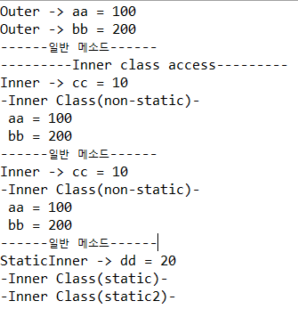

# 내부클래스

> 클래스 안에 클래스를 의미하며 코드를 간단하게 표현하기 위해 사용
>
> 선언 위치에 따라서
>
> 1. Member inner class
>
> - Non-static class
> - Static class
>
> 2. Local inner class
>
> - Named Local class
> - Anonymous class


## 1. Member Inner Class

> Member Class 접근방법
>
> - Static 변수는 클래스명으로 접근이 가능하다.
> - 내부 클래스 안에서 일반 클래스는 static 멤버를 생성할 수 없다.

```java
package Event;

public class InnerClassEx {
	public static void main(String[] args) {
		Outer ot = new Outer();
		System.out.println("Outer -> aa = " + ot.aa);
		System.out.println("Outer -> bb = " + Outer.bb);
		ot.method();
		System.out.println("---------Inner class access---------");
		
		Outer ot2 = new Outer();
		Outer.Inner oi = ot2.new Inner();
		System.out.println("Inner -> cc = " + oi.cc);
		oi.subFunc();
		
		Outer.Inner oi2 = new Outer().new Inner();
		System.out.println("Inner -> cc = " + oi2.cc);
		oi2.subFunc();
		
		Outer.StaticInner os = new Outer.StaticInner();
		System.out.println("StaticInner -> dd = " + os.dd);
		os.subFunc1();
		Outer.StaticInner.subFunc2();
		// static 멤버는 클래스명으로 접근 가능
	}
}

class Outer{
	int aa = 100; //인스턴스 변수, non-static 변수
	static int bb = 200; //클래스변수, static 변수
	
	public void method() {
		System.out.println("------일반 메소드------");
	}
	
	// 일반 내부 클래스 안에서는 static 멤버를 만들 수 없다.
	class Inner // Member Inner 클래스 (non-static 내부 클래스)
	{	
		int cc = 10;
		public void subFunc() {
			System.out.println("-Inner Class(non-static)-");
		}
		// public static void sss -> error 발생
	}
	
	static class StaticInner // Member Inner 클래스 (스태틱 내부 클래스)
	{
		int dd = 20;
		static int ddd = 30;
		public void subFunc1() {
			System.out.println("-Inner Class(static)-");
		}
		public static void subFunc2() {
			System.out.println("-Inner Class(static2)-");
		}
	}
}
```



## 2. Local Class

- this를 이용, Local 멤버 변수에 접근

```java
package Event;

public class InnerClassEx2 {
	
	public static void main(String[] args) {
		Outer1 ot1 = new Outer1();
		Outer1.Inner oi = ot1.new Inner();
		oi.InnerFunc();
	}
}

class Outer1 {
	int value = 100;
	class Inner {
		int value = 200;
		
		void InnerFunc() {
			int value = 300;
			System.out.println("InnerFunc value : " + value);
			System.out.println("Inner class value : " + this.value); 
            // Inner class 멤버 변수
			System.out.println("Outer1 value : " + Outer1.this.value);
		}
	}
}
```


- 객체를 생성해 지역 변수 접근
  - `LocalInner`는 `method()` 안에서만 접근이 가능하기 때문에 외부에서 객체를 생성해 접근 불가.
  - `method()` 안에서 `LocalInner` 멤버 변수 접근 가능

```java
package Event;

public class LocalInnerClassEx {
	
	String str = "Member variable str";
	
	public void method() {
		
		int aa = 100;
		System.out.println(str);
		System.out.println(aa);
		
		class LocalInner {
			String str1 = "Local Inner Class str";
			public void show() {
				System.out.println("LocalInnerClassEx's variable str = " + str);
				System.out.println("LocalInner's str1 = " + str1);
				System.out.println("method() local variable aa = " + aa);
				// 지역변수값에 접근하기 위해서는 final int aa 로 했어야 했다.
			}
		}
		
		LocalInner li = new LocalInner();
		li.show();
	}
	
	public static void main(String[] args) {
		LocalInnerClassEx local = new LocalInnerClassEx();
		local.method();
		
		// LocalInnerClassEx.LocalInner ll = new LocalInnerClassEx().LocalInner();
	}

}
```


## 3. Anonymous Class

> 이름이 없는 localInner Class
>
> - 클래스의 선언과 객체 생성을 동시에 한다.
> - 이름이 없기 때문에 생성자도 없다.
> - 하나의 클래스를 상속받을 수 있다.
> - 하나의 인터페이스를 구현할 수 있다.

- `Eventhandler` 객체를 생성하지 않고 버튼에 `ActionLIstener` 익명 클래스를 이용한다.
  - 실행 결과, 버튼 클릭 시 프로그램 종료

```java
package Event;

import java.awt.*;
import java.awt.event.*;

public class AnonymousEx extends Frame {
	Button btn;
	
	public AnonymousEx() {
		setBounds(200, 200, 300, 300);
		btn = new Button("Exit");
		add(btn,"South");
		
		btn.addActionListener(new ActionListener() {
			public void actionPerformed(ActionEvent ae) {
				System.exit(0);
			}
		});
	}
	
	public static void main(String[] args) {
		AnonymousEx am = new AnonymousEx();
		am.setVisible(true);
	}
}
```

### ※ 익명 클래스 활용

- 익명 클래스를 활용해 입력된 버튼을 읽어들여 문구를 작성하는 프로그램 작성
  - `GridLayout`을 이용해 2개의 질문과 결과 창을 표현한다.
  - 1번 질문에는 취미를 물어보며 4개의 `Checkbox`를 두어 중복을 포함해 선택가능
  - 2번 질문에는 연령을 물어보며 `CheckboxGroup`을 이용해 `radiobox`를 생성
  - 마지막으로 버튼을 이용해 버튼 입력시 Event 발생 체크한 박스 내용을 출력.
- 버튼 `btn`에 익명 클래스로 `ActionListener` 추가.
  - `if`문을 이용 `getState`를 이용 `Checkbox` 상태 확인 후 `getLabel`로 문자열에 추가.
    - 복수의 선택이 가능한 지문이기 때문에 `+=` 통해 문자열에 추가.
    - 연령을 물어보는 질문에는 단일 선택이기 때문에 `=` 로 추가.

```java
package Event;

import java.awt.*;
import java.awt.event.*;

public class ChkEventEx extends Frame{
	Label label1, label2, laResult;
	
	Checkbox chb1, chb2, chb3, chb4, chb5, chb6, chb7, chb8;
	CheckboxGroup gp;
	Button btn;
	
	public ChkEventEx(String title) {
		super(title);
		setBounds(100,100,500,400);
		setLayout(new GridLayout(12,1));
		
		label1 = new Label("Select your hobby");
		label2 = new Label("Select your Ages");
		laResult = new Label("Result : ");
		
		chb1 = new Checkbox("Reading");
		chb2 = new Checkbox("Exercising");
		chb3 = new Checkbox("Traveling");
		chb4 = new Checkbox("ETC");
		
		gp = new CheckboxGroup();
		chb5 = new Checkbox("10", gp, false);
		chb6 = new Checkbox("20", gp, false);
		chb7 = new Checkbox("30", gp, false);
		chb8 = new Checkbox("40", gp, false);
		
		btn = new Button("Result");
		
		add(label1); add(chb1); add(chb2); add(chb3); add(chb4);
		add(label2); add(chb5); add(chb6); add(chb7); add(chb8);
		add(btn); add(laResult);
		
		btn.addActionListener(new ActionListener() {
			String str = "";
			String str2 = "";
			public void actionPerformed(ActionEvent ae) {
				if(chb1.getState()) str += chb1.getLabel();
				if(chb2.getState()) str += chb2.getLabel();
				if(chb3.getState()) str += chb3.getLabel();
				if(chb4.getState()) str += chb4.getLabel();
				
				if(chb5.getState()) str2 = chb5.getLabel();
				if(chb6.getState()) str2 = chb6.getLabel();
				if(chb7.getState()) str2 = chb7.getLabel();
				if(chb8.getState()) str2 = chb8.getLabel();
				
			laResult.setText("your hobby " + str + " and your age is " + str2);
			}
		});
	}
	
	public static void main (String[] args) {
		ChkEventEx chk = new ChkEventEx("CheckBox Event Test");
		chk.setVisible(true);
	}
}
```


