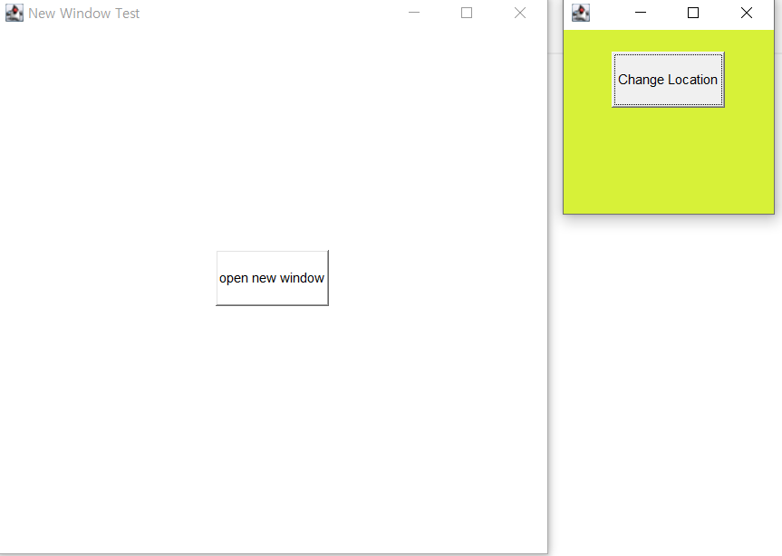

# Graphics Class

> 그림을 그리기 위한 객체(그래픽 처리를 위한 객체)
>
> - 문자를 출력하거나, 도형, 색, 선을 그리는 기능
>
> 모든 컴포넌트는 Graphics 객체를 갖고 있다.
>
> `paint()` / `repaint()` / `update()` 메소드
>
> 1. `paint()`: 프로그래머가 직접 호출
> 2. `repaint()` : 프로그래머가 호출할 수 있는 메소드
> 3. `update()` : 프로그래머가 `repaint()`를 호출하면 JVM은 `paint()`를 호출하기 앞서, `update()` 메소드 호출


## 1.Paint() 예제

- `setFonts()` : 글자 폰트 및 사이즈 설정
- `drawString()` : draw는 선으로 출력, fill 선색으로 칠한다.
- `drawOval()` : 원 그리기
- `fillOval()` : 색이 채워진 원 그리기
  - `setColor(Color.red)` : 색을 설정한다. 해당 코드 밑으로 전부 설정한 색으로 그려진다.
- `drawRect()` : 사각형 그리기
  - `drawRoundRect()` : 꼭지점이 원형인 사각형 그리기
- `fillPolygon()` : 색이 채워진 다각형 그리기
  - `g.fillPolygon(new int[] {20,40,80},new int[] {50,50, 100} ,3)`=> 삼각형이 그려진다.
  - 각 점의 좌표는 배열을 생성 후 배열 안에 입력

```java
package Graphics;
import java.awt.*;
import java.awt.event.*;
public class PaintEx extends Frame{
	public PaintEx() {
		super("Paint Test");
		setBounds(200,200,300,300);
		setVisible(true);	
		addWindowListener(new WindowAdapter() {
			public void windowClosing(WindowEvent we) {System.exit(0);}
		});
	}
	public void paint(Graphics g) {
		g.setFont(new Font("궁서", Font.BOLD, 20));
		g.drawString("Hello", 10, 50); // draw 선으로 출력, fill 선색으로 칠한다.
		
		g.drawOval(20, 100, 200, 200);
		g.setColor(Color.red);
		g.fillOval(100, 100, 200, 200);
		
		g.drawRect(50, 50, 50, 50);
		
		g.drawRoundRect(100, 100, 50, 50, 10, 10);
		
		g.fillPolygon(new int[] {20,40,80},new int[] {50,50, 100} ,3);
	}
	
	public static void main(String[] args) {
		PaintEx pe = new PaintEx();
	}}
```


## 2.repaint 예제

- `MouseMotionListener`를 이용, 마우스를 움직일 때 그림판과 같이 그림을 그릴 수 있도록 하는 예제
- `MouseMotionAdapter`를 사용하는 경우, `EventHandler` 클래스에 `mouseDragged` 함수를 생성해 드래그할 때 마다 `x` , `y` 좌표를 얻어와 `paint()` 함수에서 사용
  - `MouseMotionAdapter`를 사용하지 않는 경우 `mouseMoved`, `mouseDragged` 추상 메서드를 모두 생성해야한다.

```java
package Graphics;

import java.awt.*;
import java.awt.event.*;

public class RepaintEx extends Frame implements MouseMotionListener{
	int x = 0,y = 0;
	public RepaintEx() {
		super("Repaint Test");
		setBounds(200,200,300,300);
		setVisible(true);
//		addMouseMotionListener(this);
		addMouseMotionListener(new EventHandler());
		addWindowListener(new WindowAdapter() {
			public void windowClosing(WindowEvent we) {
				System.exit(0);
			}
		});
	}
	class EventHandler extends MouseMotionAdapter{
		public void mouseDragged(MouseEvent me) {
			x = me.getX();
			y = me.getY();
			repaint();
		}
	}
//	public void mouseMoved(MouseEvent me) {
//		x = me.getX();
//		y = me.getY();
//		repaint();
//	}
	
	
//	public void mouseDragged(MouseEvent me) {
//		x = me.getX();
//		y = me.getY();
//		repaint();
//	}
	public void update(Graphics g) {
		paint(g);
	}
	public void paint(Graphics g) {
		g.drawString("move mouse", 20, 50);
		g.drawString("#", x, y);
	}
	public static void main(String[] args) {
		RepaintEx re = new RepaintEx();
	}
}
```


## 3. Canvas 클래스

- `Canvas`를 활용하는 방법
  - `Canvas` 영역에서만 그림을 그릴 수 있도록 했다.

```java
package Graphics;
import java.awt.*;
import java.awt.event.*;

public class CanvasEx extends Frame{
	DemoCanvas demoCanvas;
	public CanvasEx() {
		super("Canvas Test");
		setLayout(new FlowLayout());
		setBounds(200,200,500,500);
		
		demoCanvas = new DemoCanvas();
		demoCanvas.setSize(300,300);
		add(demoCanvas);
		demoCanvas.setBackground(Color.yellow);
		setVisible(true);
		
		demoCanvas.addMouseMotionListener(new EventHandler());
		addWindowListener(new WindowAdapter() {
			public void windowClosing(WindowEvent we) {
				System.exit(0);
			}
		});
	}
	class EventHandler extends MouseMotionAdapter {
		public void mouseDragged(MouseEvent me) {
			demoCanvas.x = me.getX();
			demoCanvas.y = me.getY();
			demoCanvas.repaint();
			// 마우스 드래그 이용 canvas에만 그림 
		}
	}
	public static void main(String[] args) {
		CanvasEx ce = new CanvasEx(); 
	}
}

class DemoCanvas extends Canvas{
	int x = 50, y = 50;
	
	public void update(Graphics g) {
		paint(g);
	}
	
	public void paint(Graphics g) {
		g.setColor(Color.red);
		g.drawString("@", x , y);
	}
}
```


## 4. 그림판 만들기

- 위에서 배운 내용을 토대로 그림판을 생성한다.
  - Panel
    - pall : 그림판 왼쪽에 위치할 Panel로 다른 Panel를 담는 Panel이다.
    - p1 : 색을 조절하는 Button을 담을 Panel
    - p2 : 크기 조절 및 수정을 담당할 Button을 담을 Panel
    - pright : 그림그리는 Canvas를 담을 Panel
  - Button
    - Color : 색 조정을 담당할 Button
    - Size : 크기 조절 및 수정을 담당할 Button
  - CanvasDemo
    - 그림 그리는 Canvas

```java
package Graphics;

import java.awt.*;
import java.awt.event.*;

public class PaintSampleEx extends Frame{
	Panel pall, p1, p2, pright;
	Button blue, orange, green, plus, minus, erase, eraseAll;
	CanvasDemo cd;
	
	public PaintSampleEx(){
		super("Paint Application Test");
		pall =new Panel(new BorderLayout());
		pall.setBackground(Color.lightGray);
		add(pall,"West");
		
        // 색을 담당할 Button을 담는 Panel
		p1 = new Panel(new GridLayout(3,1)){
			public Insets getInsets(){
				return new Insets(10,10,10,10);
			}
		};
		
		
		pall.add(p1,"North");
		// 각 버튼별로 색 이름 및 배경색 지정
		blue = new Button();
		blue.setBackground(Color.blue);
		orange = new Button();
		orange.setBackground(Color.orange);
		green = new Button();
		green.setBackground(Color.green);
		
		p1.add(blue);p1.add(orange);p1.add(green);
		
        // 각 버튼별 기능 이름을 지정한 버튼 설정
		plus = new Button("+");
		minus = new Button("-");
		erase = new Button("Erase");
		eraseAll = new Button("Erase-All");
		
		// 기능별 버튼 p2에 할당	
		p2 = new Panel(new GridLayout(4,1)){
			public Insets getInsets(){
				return new Insets(20,10,220,10);
			}
		};
		
		p2.add(plus);p2.add(minus);p2.add(erase);p2.add(eraseAll);
		
		pall.add(p2,"Center");
		
        // Canvas를 담을 Panel 생성
		pright = new Panel(){
			public Insets getInsets(){
				return new Insets(60,20,20,20);
			}
		};
		
		pright.setBackground(Color.gray);
		add(pright,"Center");
		
        // Canvas 생성
		cd = new CanvasDemo();
		cd.setSize(300,300);
		cd.setBackground(Color.white);
		pright.add(cd);
		
        // 각 Button 마다 EventListener 생성, 이벤트 발생시 작동
		blue.addActionListener(new EventHandler());
		orange.addActionListener(new EventHandler());
		green.addActionListener(new EventHandler());
		plus.addActionListener(new EventHandler());
		minus.addActionListener(new EventHandler());
		erase.addActionListener(new EventHandler());
		eraseAll.addActionListener(new EventHandler());		
		
        // Canvas에 MouseMotionListener 생성
		cd.addMouseMotionListener(new EventHandler());
		
        // Window 닫기 버튼 클릭시 종료되는 Event 생성
		addWindowListener(new WindowAdapter(){
			public void windowClosing(WindowEvent we){
				System.exit(0);
			}
		});
	}
	
	class EventHandler extends MouseMotionAdapter implements ActionListener{
        // 드래그 시 Canvas의 x,y 좌표를 받아 repaint()하는 함수
		public void mouseDragged(MouseEvent me){
			cd.x = me.getX();
			cd.y = me.getY();
			cd.repaint();
		}
		
        // 버튼 클릭 시 각 버튼의 색, 소스를 가져와 blue, orane, green 중 색이 존재한다면
        // 해당 색으로 Color 변경
        // 해당 색들이 없을 경우 소스를 불러와 해당 버튼의 이름에 따른 기능들 설정
		public void actionPerformed(ActionEvent ae){
			Object obj = ae.getSource();
			Color btncol=((Button)obj).getBackground();
			cd.sw = 0;
			if(btncol ==Color.blue){
				cd.color = btncol;
			}else if(btncol ==Color.orange) {
				cd.color = btncol;
			}else if(btncol == Color.green){
				cd.color =  btncol;
			}else if(obj ==plus){
				cd.w++;
				cd.h++;
			}else if (obj ==minus){
				if(cd.w > 5){
					cd.w--; cd.h--;
				}
			}else if (obj == erase){
				cd.color = cd.getBackground();
			}else if (obj == eraseAll){
				cd.sw = 1; 
				cd.repaint();
			}		
		}
	}

	public static void main(String[] args) {
        // window 생성 및 설정
		PaintSampleEx ps = new PaintSampleEx();
		ps.setBounds(100, 100,	600, 500);
		ps.setVisible(true);
	}
}

class CanvasDemo extends Canvas{
    // 초기 Canvas 설정
	int x = 0, y=0, w = 5, h=5;
	int sw = 0; 
	Color color = Color.BLUE;
	
	public void paint(Graphics g){
		// paint 함수 overriding
		if(sw == 0){
			g.setColor(color);
		//g.drawString("#", x, y);
			g.fillOval(x, y, w, h);
		}else if(sw ==1){
			g.clearRect(0, 0, 300, 300);
		}
	}
	// repaint() 시 update 하는 함수
	public void update(Graphics g){
		paint(g);
	}
}
```


#### ※ Random(), Random Class

- 랜덤한 값, 난수를 발생시켜주는 함수 및 클래스
  - `Math.random()` 은 0과 1사이의 랜덤한 값을 출력한다.
  - `int`형으로 표현하기 위해서는 10을 곱해야 한다.
  - `Random calss`의 경우 `java.util.Random`을 `import`
    - 인자가 같을 경우 같은 난수 생성한다.
  - `nextInt`로 `int`형 난수 생성, (-2147483648 ~ 2147483647) 사이의 값 출력
    - `nextInt(10)` : 0 ~ 9 까지의 랜덤한 int형 출력

```java
package Graphics;

import java.util.*;

	
public class RandomEx1 {

	public static void main(String[] args) {
		//	0 < Math.random() < 1
		//	double aa = Math.random();
		int aa = ((int)(Math.random()*10))+1;
		// 	1 < ((int)(Math.random()*10))+1 < 11
		System.out.println(aa);
		
        // 종가값이 같으면 같은 랜덤한 정수를 출력
		Random random = new Random(1);
		Random random2 = new Random(1);

        // -2^31 ~ 2^31 - 1
		int i = random.nextInt();
		System.out.println(i);
		
		int i2 = random2.nextInt();
		System.out.println(i2);
	}
}
```


## 5. Sub Frame
> `Button` 클릭 시 새로운 window를 생성하는 예제
>
> - 새로운 `window`에서 Event 발생 시 처리하는 예제
```java
package Graphics;

import java.awt.*;
import java.awt.event.*;

public class SubframeEx extends Frame implements ActionListener{
	Button open;
	Dimension d;
	SubFrame sub;
	
	public SubframeEx() {
		super("New Window Test");
		setSize(500,500);
		d = getSize();
		setVisible(true);
		setLayout(null);
		
		open = new Button("open new window");
		open.setSize(100,50);
		Dimension bd = open.getSize();
		
		int x = d.width/2 - bd.width/2;
		int y = d.height/2 - bd.height/2;
		
		open.setLocation(x,y);
		add(open);
		
		open.addActionListener(this);
		
        // SubFrame 생성자 및 이벤트리스너 생성
		sub = new SubFrame();
		sub.setSize(200,200);
		sub.btn.addActionListener(this);
		
		addWindowListener(new WindowAdapter() {
			public void windowClosing(WindowEvent we) {
				System.exit(0);
			}
		});
		
	}
	public void actionPerformed(ActionEvent ae) {
		Object obj = ae.getSource();
		if(obj == open) {
            // open 버튼 클릭 시 sub winow 색상 변경
            // random 클래스 및 함수 이용해 랜덤 색상 변경
//			SubFrame sub = new SubFrame();
//			int r = (int)(Math.random()*256);
//			int g = (int)(Math.random()*256);
//			int b = (int)(Math.random()*256);
			
			java.util.Random rand = new java.util.Random();
			int r = rand.nextInt(256);
			int g = rand.nextInt(256);
			int b = rand.nextInt(256);

			sub.setBackground(new Color(r,g,b));
			sub.setLocation(d.width, 0);
			
		}else if (obj == sub.btn) {
            // sub window의 버튼 입력시 버튼의 위치를 랜덤으로 변경
			java.util.Random rand = new java.util.Random();
			int x = rand.nextInt(100);
			int y = rand.nextInt(150);
			sub.btn.setLocation(x,y);
		}
		sub.addWindowListener(new WindowAdapter() {
			public void windowClosing(WindowEvent we) {
                // sub window의 windowclosing 함수
                // setVisible(false)로 설정 시 윈도우는 사라지지만
                // 메모리에는 남아있기 때문에 dispose() 이용
				sub.dispose();
			}
		});
		
		sub.setVisible(true);
	}
	public static void main(String[] args) {
		SubframeEx sf = new SubframeEx();	
	}
}

class SubFrame extends Frame{
	int r=255, g=255, b=255;
	int x = 50, y = 50;
	Button btn;
	public SubFrame() {
        // Sub Window의 초기 설정
        // 이후 SubframeEx의 actionPerformed로 처리되기 때문에 영향을 주지 않는다.
		setLayout(null);
		setBackground(new Color(r, g, b));
//		btn = new Button("Change Color");
		btn = new Button("Change Location");
		btn.setSize(100,50);
		btn.setLocation(x,y);
		add(btn);
	}
	
//	public void actionPerformed(ActionEvent ae) {
//		java.util.Random rand = new java.util.Random();
//		int r = rand.nextInt(256);
//		int g = rand.nextInt(256);
//		int b = rand.nextInt(256);
//		setBackground(new Color(r,g,b));
//	}
}
```

 

