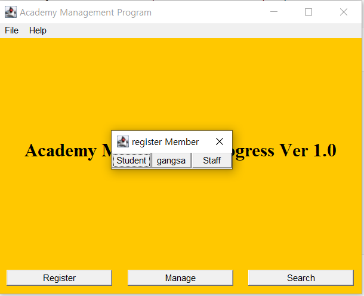
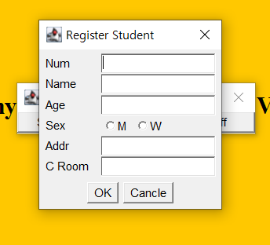

# AWT Program

> 학원생들을 관리하는 프로그램 작성해보기

## 1. 멤버 생성

> 클래스를 생성한다. `Member` 클래스와 `Member` 클래스를 상속받는 `Student`, `Staff`, `Gangsa` 클래스를 추가로 생성한다.

### 1. Member 클래스

> - `String` 형태의 `name`, `age`, `sex`, `addr` 변수를 선언 및 `set`, `get` 메소드를 생성한다.
> - `Member` 생성자 설정

```java
package awtprj;
public class Member {
	private String name;
	private String age;
	private String sex;
	private String addr;

	public Member() {
		super();
	}
	public Member(String name, String age, String sex, String addr) {
		super();
		this.name = name;
		this.age = age;
		this.sex = sex;
		this.addr = addr;
	}
	
	public String getName() {
		return name;
	}
	public void setName(String name) {
		this.name = name;
	}
	// 생략
}
```

> 생성자 및 set, get 메소드는 eclipse의 기능으로 간단하게 생성가능
>
> - 생성자 : `Source → Select super constructor using Fields`
> - 메소드 : `Source → Select getters and setters to create`


### 2. 상속 클래스 생성

> `Member` 클래스를 상속받는 강사, 직원, 학생 클래스를 생성한다.
>
> 각각 클래스들은 아래와 같은 변수를 갖는다.
>
> - 강사 - 교사번호(id), 과목(Subject)
> - 직원 - 직원번호(id), 부서(dept)
> - 학생 - 학생번호(id), 교실(classRoom)

- Ex) `Student Class`

```java
package awtprj;
public class Student extends Member{
	private int id;
	private String classRoom;
	public int getId() {
		return id;
	}
	public void setId(int id) {
		this.id = id;
	}
	public String getClassRoom() {
		return classRoom;
	}
	public void setClassRoom(String classRoom) {
		this.classRoom = classRoom;
	}}
```

## 2. Main 함수

### 1. GUI 작업

    

- 예상 작업물
  - `File`, `Help` 메뉴를 담을 `MenuBar`, `Menu` 각 메뉴마다 `MenuItem` 필요.
  - `Register`, `Manage`, `Search` 버튼과 버튼을 담을 `Panel` 필요.
  - 'Ver 1.0' 문구를 기록하기 위한 `Label` 필요.


```java
public class Main extends Frame{
	Toolkit tk; 								// 
	Dimension screenSize, fsize;				// window 및 dialog 위치 조절
	MenuBar mb;									// Menubar
	Menu mf, mh;								// Menubar에 들어갈 File, Help 메뉴
	MenuItem miOpen, miSave, miExit, miAbout;	// File, Help에 들어갈 메뉴 모음
	
	Panel p;									// 등록, 관리, 검색 버튼 Panel
	Button regBtn, manageBtn, searchBtn;		// 등록, 관리, 검색 버튼
    Button studentBtn, gangsaBtn, staffBtn;		// p 버튼 클릭 시 생성되는 dialog의 버튼
	Button okBtn, cancleBtn;					// dialog의 ok, 취소 버튼
	Label lb;									// window 창 ver 문구 label
	Label lbId, lbName, lbAge, lbSex, lbAddr, lbCroom;	//	dialog label
	
	CheckboxGroup group;		// 성별 검색용 checkboxgroup
	Checkbox chman, chwoman;	// 성별 검색용 checkbox
	
	TextField	tId, tName, tAge, tAddr, tCroom;	// dialog label별 텍스트 영역
	
	Dialog dl[] = new Dialog[2];	// dialog, 배열 형태를 이용 복수개의 dialog를 생성
    
    public static void main(String[] args) {
		new Main();
	}   
}
```

> 변수 선언

#### 1) Menu 설정

- 메뉴를 담을 `mb`를 `MenuBar()` 생성자를 통해 생성
- `File` 메뉴와 `Help` 메뉴 `Menu()` 생성자를 통해 생성
  - `MenuItem()` 생성자를 이용 `open`, `save`, `exit`, `about` 메뉴를 생성 및 추가한다.

```java
mb = new MenuBar();
mf = new Menu("File");

miOpen = new MenuItem("Open");
miSave = new MenuItem("Save");
miExit = new MenuItem("Exit");

mf.add(miOpen);
mf.add(miSave);
mf.addSeparator();
mf.add(miExit);
mb.add(mf);

mh = new Menu("Help");
miAbout = new MenuItem("About");
mh.add(miAbout);
mb.add(mh);

setMenuBar(mb);
```

#### 2) Button 설정

- `register`, `manage`, `search`에 해당하는 버튼 생성 후 `panel`에 추가
  - `panel`은 `GridLayout`을 이용해 정렬, (1,0,20,20)은 1행, *열, h_gap, v_gap이 각각 20으로 설정
  - `Insets`을 이용해 `panel`과 버튼 사이의 간격을 조절

```java
regBtn = new Button("Register");
manageBtn = new Button("Manage");
searchBtn = new Button("Search");

p = new Panel(new GridLayout(1,0, 20, 20)) {
    public Insets getInsets( ) {
        return new Insets(10, 10, 10, 10);
    }
};

p.add(regBtn);p.add(manageBtn);p.add(searchBtn); 
add(p,"South");
```

#### 3) Label 설정

- `Label`에 문구 추가

```java
lb = new Label("Academy Management Progress Ver 1.0", Label.CENTER);
Font myFont = new Font("Serif", Font.BOLD, 25);
lb.setFont(myFont);
add(lb, "Center");
```

#### 4) SubFrame 작성

- Register, Manage, Search등 버튼을 눌렀을 때 `dialog`를 생성하도록 설정

- `dialog`는 총 배열 형태와 for문을 이용해 필요한 만큼 `dialog`를 생성해 사용

  - 각 버튼마다 `addActionListener()`추가
  - `EventHandler` 클래스를 생성, 각 버튼 클릭시 `dialog`창을 열 수 있도록 설정

  ```java
  tk = Toolkit.getDefaultToolkit();
  screenSize = tk.getScreenSize();
  
  dl[0] = new Dialog(this);
  		// modal 
  dl[0].setLayout(new GridLayout(1,0));
  dl[0].add(studentBtn);dl[0].add(gangsaBtn);dl[0].add(staffBtn );
  dl[0].pack(); // 모든 버튼을 담는 최소 크기로 자동 설정
  Dimension dlsize = dl[0].getSize();
  dl[0].setLocation(screenSize.width/2 - dlsize.width/2 , screenSize.height/2 - dlsize.height/2);
  ```

  > `dialog`창 설정

  ```java
  class EventHandler implements ActionListener{
  		public void actionPerformed(ActionEvent ae) {
  			Object obj = ae.getSource();
  			if (obj == regBtn) {
  				dl[0].setTitle("register Member");
  				dl[0].setVisible(true);
  			}else if(obj == manageBtn) {
  				dl[0].setTitle("Management Member");
  				dl[0].setVisible(true);
  			}else if (obj == searchBtn){	}
  ```

  > 버튼 클릭 시 `dialog`창 생성

  

- Register 버튼 입렵 시 학생, 강사, 직원 별로 등록, 관리하는 창 만들기

  - 멤버 클래스를 생성하면서 설정한 변수들을 설정
  - 3개의 `Panel`이 필요. 
    - `Label`을 담는 `Panel`
    - `TextField`를 담는 `Panel`
    - 최종 수락 및 취소 버튼을 담는 `Panel`이 필요하다.

```java
group = new CheckboxGroup();
chman = new Checkbox("M", group, false);
chwoman = new Checkbox("W", group, false);

Panel dp1 =new Panel(){
    public Insets getInsets() {
        return new Insets(5, 5, 0, 0);
    }
};

Panel dpsex = new Panel(new FlowLayout(FlowLayout.LEFT)) {
			public Insets getInsets() {
				return new Insets(-5, 0, 0, 0);
			}
		};
dpsex.add(chman);dpsex.add(chwoman);

dp1.setLayout(new GridLayout(6,1));
dp2.setLayout(new GridLayout(6,1));

dp1.add(lbId = new Label("Num"));
dp1.add(lbName = new Label("Name"));
dp1.add(lbAge = new Label("Age"));
dp1.add(lbSex = new Label("Sex"));
dp1.add(lbAddr = new Label("Addr"));
dp1.add(lbCroom = new Label("C Room"));

dp2.add(tId = new TextField());
dp2.add(tName = new TextField());
dp2.add(tAge = new TextField());
dp2.add(dpsex);
dp2.add(tAddr = new TextField());
dp2.add(tCroom = new TextField());

okBtn = new Button("OK");
cancleBtn = new Button("Cancle");
dp3.add(okBtn); dp3.add(cancleBtn);
```

> `dialog`창 설정

```java
class EventHandler implements ActionListener{
		public void actionPerformed(ActionEvent ae) {
			Object obj = ae.getSource();
			if (obj == regBtn) {
				dl[0].setTitle("register Member");
				dl[0].setVisible(true);
			}else if(obj == manageBtn) {
				dl[0].setTitle("Management Member");
				dl[0].setVisible(true);
			}else if (obj == searchBtn){
				
			}else if(obj == studentBtn) {
				if(dl[0].getTitle()=="Management Member") {
					dl[1].setTitle("Management Student");
					dl[1].setVisible(true);
				} else {
					dl[1].setTitle("Register Student");
					dl[1].setVisible(true);
				}
			}else if(obj == gangsaBtn) {
				if(dl[0].getTitle()=="Management Member") {
					dl[1].setTitle("Management gangsa");
					dl[1].setVisible(true);
				} else {
					dl[1].setTitle("Register gangsa");
					dl[1].setVisible(true);
				}
			}else if(obj == staffBtn) {
				if(dl[0].getTitle()=="Management Member") {
					dl[1].setTitle("Management staff");
					dl[1].setVisible(true);
				} else {
					dl[1].setTitle("Register staff");
					dl[1].setVisible(true);
				}}}}
```

> 각 입력에 따른 `dialog` 창 `Title` 변경




