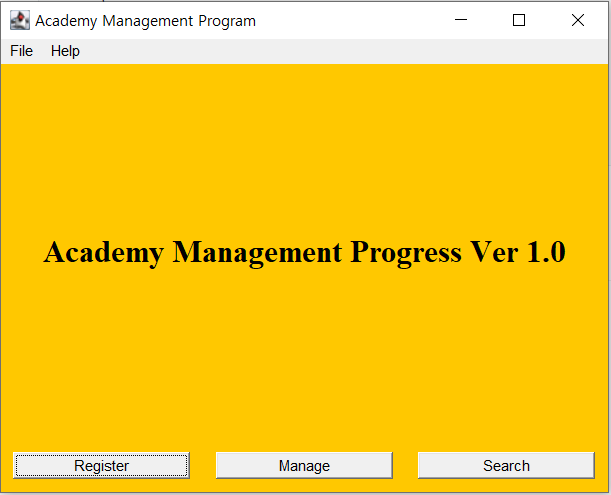
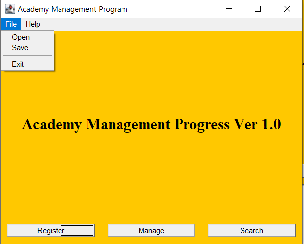

# AWT Program

> 학원생들을 관리하는 프로그램 예제


## 1. 멤버 생성

> 클래스를 생성한다. `Member` 클래스와 `Member` 클래스를 상속받는 `Student`, `Staff`, `Gangsa` 클래스를 추가로 생성한다.


### 1. Member 클래스

> - `String` 형태의 `name`, `age`, `sex`, `addr` 변수를 선언 및 `set`, `get` 메소드를 생성한다.
> - `Member` 생성자 설정

```java
package awtprj;
public class Member {
	private String name;
	private String age;
	private String sex;
	private String addr;

	public Member() {
		super();
	}
	public Member(String name, String age, String sex, String addr) {
		super();
		this.name = name;
		this.age = age;
		this.sex = sex;
		this.addr = addr;
	}
	
	public String getName() {
		return name;
	}
    
	public void setName(String name) {
		this.name = name;
	}

	public String getAge() {
		return age;
	}

	public void setAge(String age) {
		this.age = age;
	}

	public String getSex() {
		return sex;
	}

	public void setSex(String sex) {
		this.sex = sex;
	}

	public String getAddr() {
		return addr;
	}

	public void setAddr(String addr) {
		this.addr = addr;
	}
}
```

> 생성자 및 set, get 메소드는 eclipse의 기능으로 간단하게 생성가능
>
> - 생성자 : `Source → Select super constructor using Fields`
> - 메소드 : `Source → Select getters and setters to create`


### 2. 상속 클래스 생성

> `Member` 클래스를 상속받는 강사, 직원, 학생 클래스를 생성한다.
>
> 각각 클래스들은 아래와 같은 변수를 갖는다.
>
> - 강사 - 교사번호(id), 과목(Subject)
> - 직원 - 직원번호(id), 부서(dept)
> - 학생 - 학생번호(id), 교실(classRoom)

- Ex) `Student Class`

```java
package awtprj;

public class Student extends Member{
	private int id;
	private String classRoom;
	
	public int getId() {
		return id;
	}

	public void setId(int id) {
		this.id = id;
	}

	public String getClassRoom() {
		return classRoom;
	}

	public void setClassRoom(String classRoom) {
		this.classRoom = classRoom;
	}	
}
```


## 2. Main 함수

### 1. GUI 작업

    

- 예상 작업물
- `File`, `Help` 메뉴를 담을 `MenuBar`, `Menu` 각 메뉴마다 `MenuItem` 필요.
- `Register`, `Manage`, `Search` 버튼과 버튼을 담을 `Panel` 필요.
- 'Ver 1.0' 문구를 기록하기 위한 `Label` 필요.

```java
public class Main extends Frame{
	MenuBar mb;
	Menu mf, mh;
	MenuItem miOpen, miSave, miExit, miAbout;
	
	Panel p;
	Button regBtn, manageBtn, searchBtn;
	Label lb;
    
    public static void main(String[] args) {
		new Main();
	}   
}
```

> 변수 선언

#### 1) Menu 설정

- 메뉴를 담을 `mb`를 `MenuBar()` 생성자를 통해 생성
- `File` 메뉴와 `Help` 메뉴 `Menu()` 생성자를 통해 생성
  - `MenuItem()` 생성자를 이용 `open`, `save`, `exit`, `about` 메뉴를 생성 및 추가한다.

```java
mb = new MenuBar();
mf = new Menu("File");

miOpen = new MenuItem("Open");
miSave = new MenuItem("Save");
miExit = new MenuItem("Exit");

mf.add(miOpen);
mf.add(miSave);
mf.addSeparator();
mf.add(miExit);
mb.add(mf);

mh = new Menu("Help");
miAbout = new MenuItem("About");
mh.add(miAbout);
mb.add(mh);

setMenuBar(mb);
```

#### 2) Button 설정

- `register`, `manage`, `search`에 해당하는 버튼 생성 후 `panel`에 추가
  - `panel`은 `GridLayout`을 이용해 정렬, (1,0,20,20)은 1행, *열, h_gap, v_gap이 각각 20으로 설정
  - `Insets`을 이용해 `panel`과 버튼 사이의 간격을 조절

```java
regBtn = new Button("Register");
manageBtn = new Button("Manage");
searchBtn = new Button("Search");

p = new Panel(new GridLayout(1,0, 20, 20)) {
    public Insets getInsets( ) {
        return new Insets(10, 10, 10, 10);
    }
};

p.add(regBtn);p.add(manageBtn);p.add(searchBtn); 
add(p,"South");
```

#### 3) Label 설정

- `Label`에 문구 추가

```java
lb = new Label("Academy Management Progress Ver 1.0", Label.CENTER);
Font myFont = new Font("Serif", Font.BOLD, 25);
lb.setFont(myFont);
add(lb, "Center");
```


